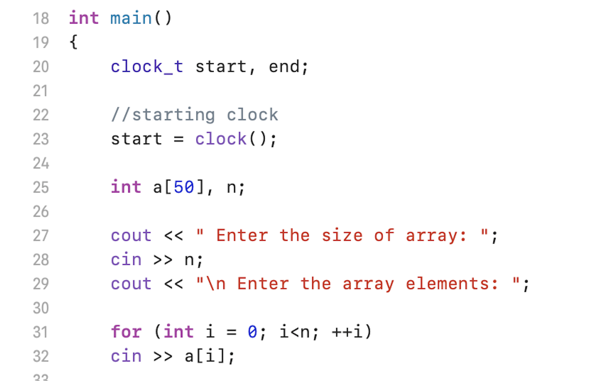
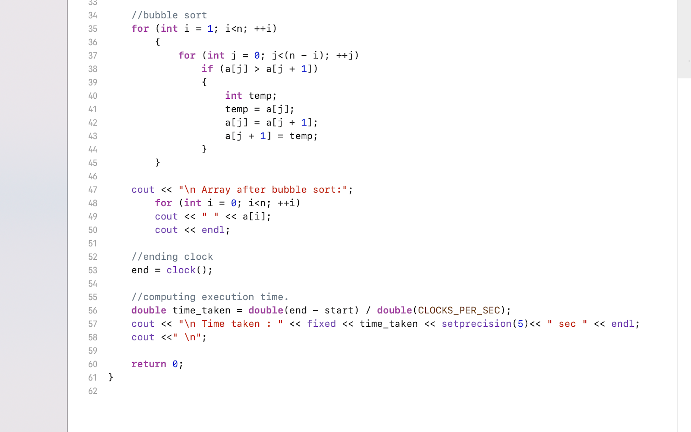
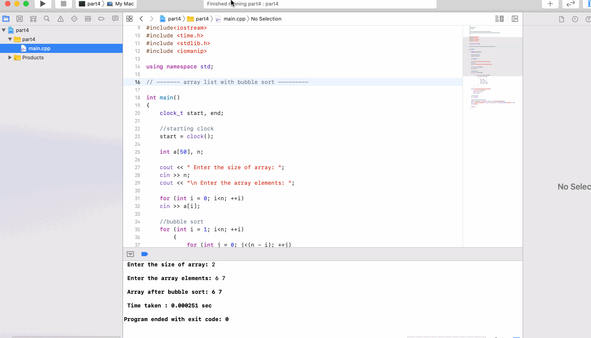

# Question-4-CSCI-313
GROUP 2- Luke Fang, Gomes Mikhaiel, Hila Ergys, Ibrat Nazara, Kaur Rupinder

A program for time taken to sort array list with bubble sort

# Libraries 

# Main Function
In my main function, first I declared clock_t start and end variables and print statements to enter size of array and array elements. And a for loop to iterate through the array and which helps to gather the data.

# Bubble Sort
Next, we wanted to sort the array using the bubble sort method. So, then I need a function to implement bubble sort. For that we use loops (for loop) and swap methods. Bubble Sort is basically the simplest sorting algorithm that works by repeatedly swapping the adjacent elements if they are in wrong order. 
  

# Conclusion
After that the program will run properly and provide a sorted list of arrays and time taken to sort the array list.

