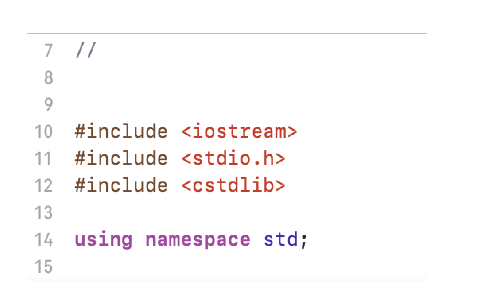
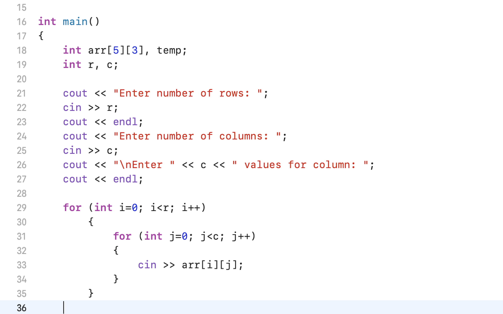
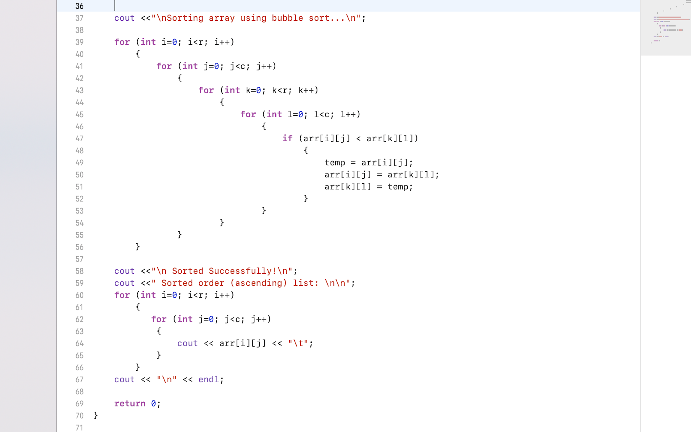

# Question-4-CSCI-313
GROUP 2- Luke Fang, Gomes Mikhaiel, Hila Ergys, Ibrat Nazara, Kaur Rupinder

A program for time taken to sort array list with bubble sort

# Libraries 

# Main Function
In my main function, first I declared clock_t start and end variables. Then I set start = clock(). I then generated an integer array of a random size, containing between one to fifty elements and declared an one random integer “n”. After that I print a statement to enter the size of the array and I use the “cin” command where I put an integer “n” that I declared before to enter the array elements. And there is another statement I print for entering the array elements. I then created a for loop to iterate through the array and which helps to gather the data. A user can print elements here in an unsorted way. This means that the program could randomly generate an array of size n. For example, put array size i.e. n = 4 and array elements put random values {66, 5, 71, 2}. Here there is no need to enter elements in sorted order. 

# Bubble Sort
Next, we wanted to sort the array using the bubble sort method. So, then I need a function to implement bubble sort. For that we use loops (for loop) and swap methods. Bubble Sort is basically the simplest sorting algorithm that works by repeatedly swapping the adjacent elements if they are in wrong order. The swap method will help to sort the array elements that we entered in unsorted order. In the first pass, this algorithm will compare the first two elements of the list {66, 5, 71, 2} and move the value 5 in position of 66, {5, 66, 71, 2} and the process will go on until it’s done. If the elements are already in order then there is no need for swapping.
  

We began the Bubble Sort function with a for loop. In the first for loop, the i-th path, the last element is already sorted there. The next loop will help in executing the pass. Then next is swap function, that will swap the elements until it’s done as i mentioned above. Once it is done, then it exits the loop and we set another for loop which helps in printing the sorted array list. After that, the user needs to set end = clock(). The reason why we use start and end clock is because it counts the runtime of the program. To make it work, the next user needs to set computing execution time. For that we’ll do some math. First we need to declare a variable using double and set it equals to end minus start. Then we’ll print the time completion using the cout statement. If after doing all this, may we get errors as I did in my program related clock. Why do I get errors, because I forget to add libraries to make the clock work. So to correct those errors we need to add these libraries #include <time.h>, #include <stdlib.h>, #include <iomanip>. After that the program will run properly and provide a sorted list of arrays and time taken to sort the array list.

# Conclusion:- 
After that the program will run properly and provide a sorted list of arrays and time taken to sort the array list.

