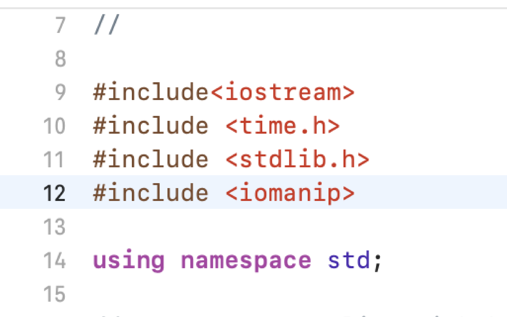

# Question-4-CSCI-313
GROUP 2- Luke Fang, Gomes Mikhaiel, Hila Ergys, Ibrat Nazara, Kaur Rupinder

A program for time taken to sort array list with bubble sort

# Libraries 

 

# Main Function
In my main function, first I declared clock_t start and end variables. Then I set start = clock(). I then generated an integer array of a random size, containing between one to fifty elements and declared an one random integer “n”. After that I print a statement to enter the size of the array and I use the “cin” command where I put an integer “n” that I declared before to enter the array elements. And there is another statement I print for entering the array elements. I then created a for loop to iterate through the array and which helps to gather the data. A user can print elements here in an unsorted way. This means that the program could randomly generate an array of size n. For example, put array size i.e. n = 4 and array elements put random values {66, 5, 71, 2}. Here there is no need to enter elements in sorted order. 

# Bubble Sort
Next, we wanted to sort the array using the bubble sort method. So, then I need a function to implement bubble sort. For that we use loops (for loop) and swap methods. Bubble Sort is basically the simplest sorting algorithm that works by repeatedly swapping the adjacent elements if they are in wrong order. 
  

# Conclusion:- 
After that the program will run properly and provide a sorted list of arrays and time taken to sort the array list.

